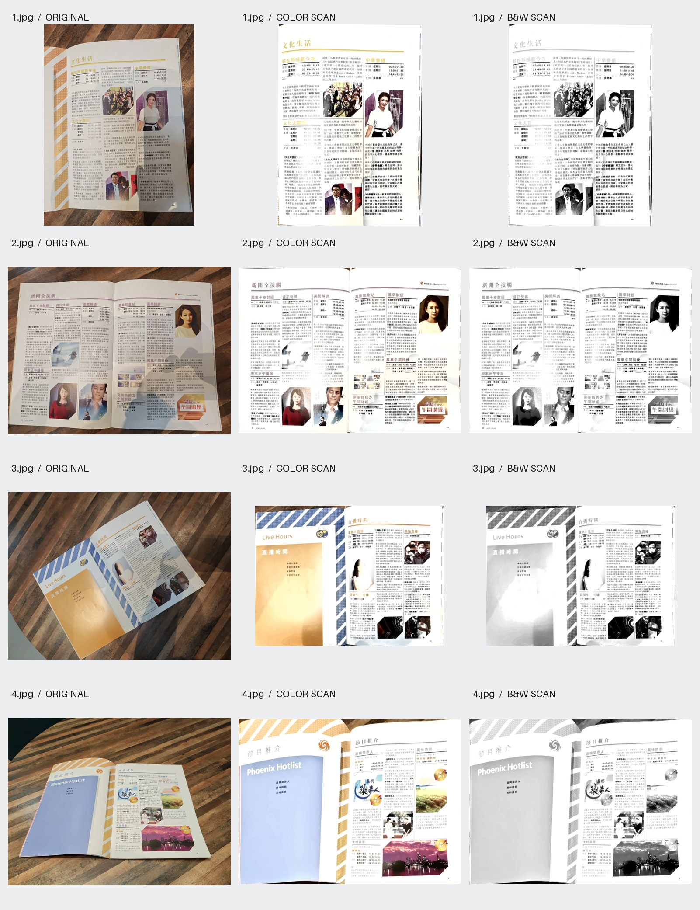

# pdf2scan

将 PDF 或页面照片转换为扫描件样式的 PDF。默认保留彩色；按需生成黑白版本。照片输入支持纸张角点检测、透视矫正和阴影提亮。

## 效果展示

下图使用四张原 JPEG。每行对应一张照片，从左到右依次是**原图、pdf2scan 彩色输出、pdf2scan 黑白输出**。



## 安装与使用

将整个 `pdf2scan/` 文件夹放入 Codex 的 `~/.agents/skills/` 或 Claude Code 的 `~/.claude/skills/`。需要 Python 3.10+ 和 Bash；在此文件夹运行 `bash scripts/setup.sh` 一次即可安装依赖。若要使用已有 Python 环境，可安装 `requirements.txt` 并将 `PDF2SCAN_PYTHON` 指向对应解释器。

```bash
bash scripts/run.sh input.pdf --output scan.pdf
bash scripts/run.sh input.jpg --output scan-bw.pdf --color-mode grayscale
```

复杂照片或打开的双页书刊可能需要手动指定纸张角点；参数格式见 [`references/geometry.md`](references/geometry.md)。输出是图像型 PDF，不能直接选择文字或点击原 PDF 的链接。
